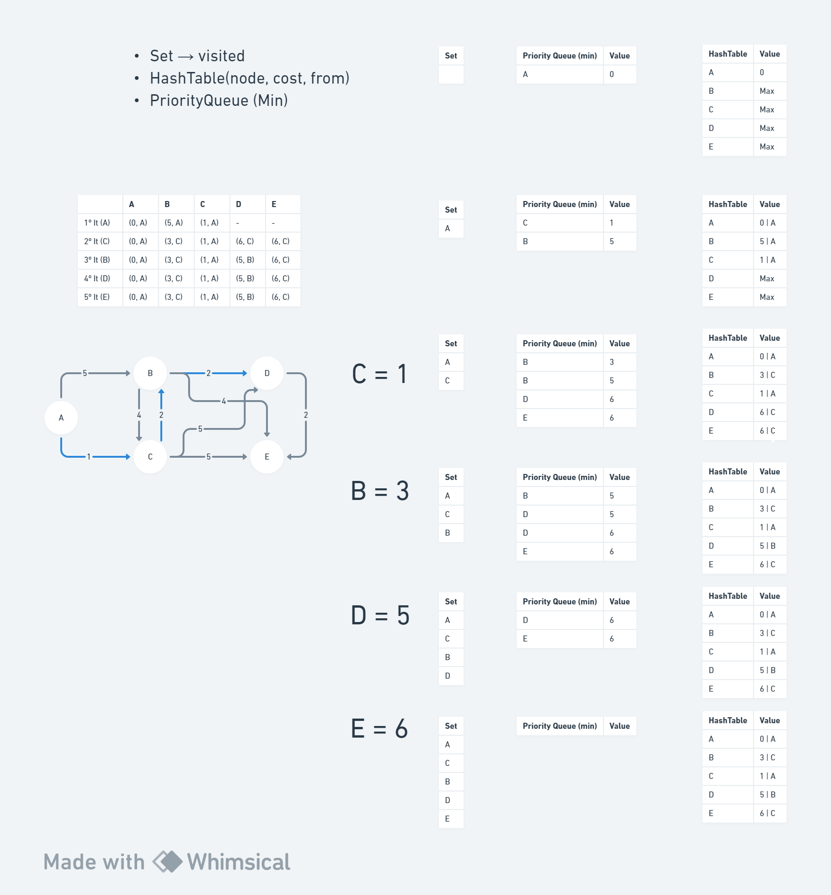
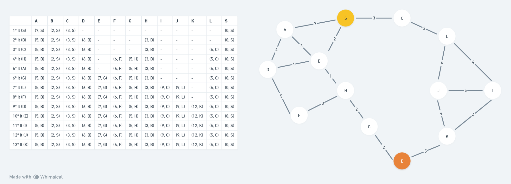

# Dijkstra's Algorithm

## Description

Dijkstra's algorithm is an algorithm for finding the shortest paths between nodes in a graph, which may represent, for
example, road networks. It was conceived by computer scientist Edsger W. Dijkstra in 1956 and published three years
later.

The algorithm exists in many variants. Dijkstra's original algorithm found the shortest path between two given nodes,
but a more common variant fixes a single node as the "source" node and finds shortest paths from the source to all other
nodes in the graph, producing a shortest-path tree.

For a given source node in the graph, the algorithm finds the shortest path between that node and every other. It can
also be used for finding the shortest paths from a single node to a single destination node by stopping the algorithm
once the shortest path to the destination node has been determined. For example, if the nodes of the graph represent
cities and edge path costs represent driving distances between pairs of cities connected by a direct road (for
simplicity, ignore red lights, stop signs, toll roads and other obstructions), Dijkstra's algorithm can be used to find
the shortest route between one city and all other cities. A widely used application of shortest path algorithm is
network routing protocols, most notably IS-IS (Intermediate System to Intermediate System) and Open Shortest Path
First (OSPF). It is also employed as a subroutine in other algorithms such as Johnson's.

## Programming Languages

### Java

#### Pre-requisites

- Java 21

#### How to run tests

- Open the project in your favorite IDE
- Run the `tests` package

or

- Via terminal
- Go to the project root folder
- Run `./mvnw test`

## Graphs used in this project

